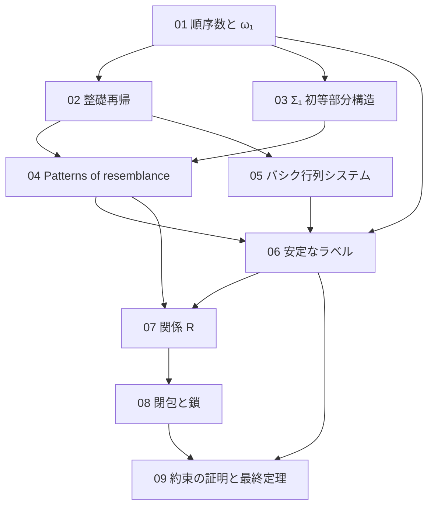

[← Back](../README.md) | [English](en/README.md) | [Japanese](README.md)

# study/

このリポジトリを読むための背景ノート。証明が既知として使う数学（順序数、整礎再帰、モデル論）と、証明の 2 つの層（DH の論文の組合せの層と、このリポジトリの意味の層）を、定義と小さい例から書き起こす。

書き方は [rule.md](rule.md) に定める。数学が [1y-wo-por の study/](https://github.com/koteitan/1y-wo-por/tree/main/study) と同じところは、同じ文と数式を使う。

## 目次

| ノート | 内容 | このリポジトリでの対応箇所 |
|---|---|---|
| [01 順序数と ω₁](01-ordinals.md) | 整列順序、後者と極限、上限、可算、$`\omega_1`$ の正則性、可算順序数の数え上げ | README「関係 R」「ラベルの約束の行き先」、notes/01-design.md |
| [02 整礎関係と整礎再帰](02-well-founded.md) | 整礎関係、到達可能、整礎帰納法、辞書式積、整礎再帰、ガードつきの再帰 | README「関係 R」、notes/01-design.md |
| [03 構造と Σ₁ 初等部分構造](03-sigma1-elementary.md) | 構造、$`\Sigma_1`$ 論理式、原子図式、$`\preccurlyeq_{\Sigma_1}`$、Tarski–Vaught 判定法、$`\Sigma_1`$ 論理式の標準形、見えるビット | README「関係 R」、notes/01-design.md |
| [04 Patterns of resemblance](04-patterns-of-resemblance.md) | Carlson の $`\le_1`$、小さい例、有限反映の形、bms-elem-pattern、上端述語を原子記号にする考え方、BMS で根の添字が要らない理由 | README「証明の形」、notes/01-design.md |
| [05 バシク行列システム](05-bms.md) | 配列、親、先祖、悪い根、展開、例 | README「何を証明したか」 |
| [06 安定なラベルと高さの降下](06-stable-labels.md) | ラベルの約束、安定なラベル、高さ、DH の命題 19.1 の概略、停止性の導き方 | README「証明の形」「ラベルの約束の行き先」、notes/01-design.md |
| [07 関係 R](07-relation-r.md) | 層 $`k`$ の構造、$`R`$ の定義、（上端、層）の再帰、定義の式、狭義性、推移律 | README「関係 R」「ラベルの約束の行き先」、notes/01-design.md |
| [08 ω₁ より下の閉包と鎖](08-closure-chain.md) | Good、証人の高さ、next、λ、λ(γ) が Good であること、鎖 | README「ラベルの約束の行き先」、notes/01-design.md |
| [09 約束の証明と最終定理](09-obligations.md) | 有限反映、上端述語の絶対性、鎖の 2 点の関係、すべての配列の安定なラベル、最終定理 4 つ | README「ラベルの約束の行き先」「何を証明したか」、notes/01-design.md |

## 読む順

