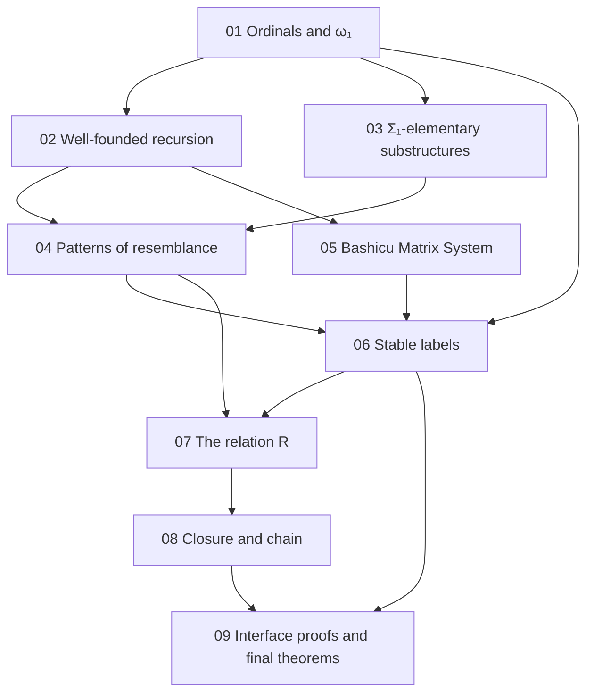

[← Back](../../README-en.md) | [English](README.md) | [Japanese](../README.md)

# study/

Background notes for reading this repository. They write out, from definitions and small examples, the mathematics the proof takes as known (ordinals, well-founded recursion, model theory) and the two layers of the proof (the combinatorial layer of DH's paper and the semantic layer of this repository).

The writing rules are fixed in [rule.md](rule.md). Where the mathematics is the same as in [the study/ of 1y-wo-por](https://github.com/koteitan/1y-wo-por/tree/main/study), the same sentences and formulas are used.

## Contents

| Note | Topic | Where it is used in this repository |
|---|---|---|
| [01 Ordinals and ω₁](01-ordinals.md) | well-orders, successors and limits, suprema, countability, regularity of $`\omega_1`$, enumerating countable ordinals | README "The relation R", "Where the label interface goes"; notes/01-design.md |
| [02 Well-founded relations and well-founded recursion](02-well-founded.md) | well-founded relations, accessibility, well-founded induction, lexicographic products, well-founded recursion, guarded recursion | README "The relation R"; notes/01-design.md |
| [03 Structures and Σ₁-elementary substructures](03-sigma1-elementary.md) | structures, $`\Sigma_1`$ formulas, atomic diagrams, $`\preccurlyeq_{\Sigma_1}`$, the Tarski–Vaught test, the normal form of $`\Sigma_1`$ formulas, visible bits | README "The relation R"; notes/01-design.md |
| [04 Patterns of resemblance](04-patterns-of-resemblance.md) | Carlson's $`\le_1`$, small examples, the shape of finite reflection, bms-elem-pattern, the idea of making top predicates atomic symbols, why BMS needs no root index | README "Shape of the proof"; notes/01-design.md |
| [05 The Bashicu Matrix System](05-bms.md) | arrays, parents, ancestors, the bad root, expansion, examples | README "What is proved" |
| [06 Stable labels and the descent of the height](06-stable-labels.md) | the label interface, stable labels, height, an outline of DH's Proposition 19.1, how termination follows | README "Shape of the proof", "Where the label interface goes"; notes/01-design.md |
| [07 The relation R](07-relation-r.md) | the structure of layer $`k`$, the definition of $`R`$, the (top, layer) recursion, the defining equation, strictness, transitivity | README "The relation R", "Where the label interface goes"; notes/01-design.md |
| [08 Closure below ω₁ and the chain](08-closure-chain.md) | Good, heights of witnesses, next, λ, λ(γ) is Good, the chain | README "Where the label interface goes"; notes/01-design.md |
| [09 Proofs of the label interface and the final theorems](09-obligations.md) | finite reflection, absoluteness of the top predicates, two points of the chain are related, a stable label on every array, the four final theorems | README "Where the label interface goes", "What is proved"; notes/01-design.md |

The notes in `notes/` are in Japanese.

## Reading order

